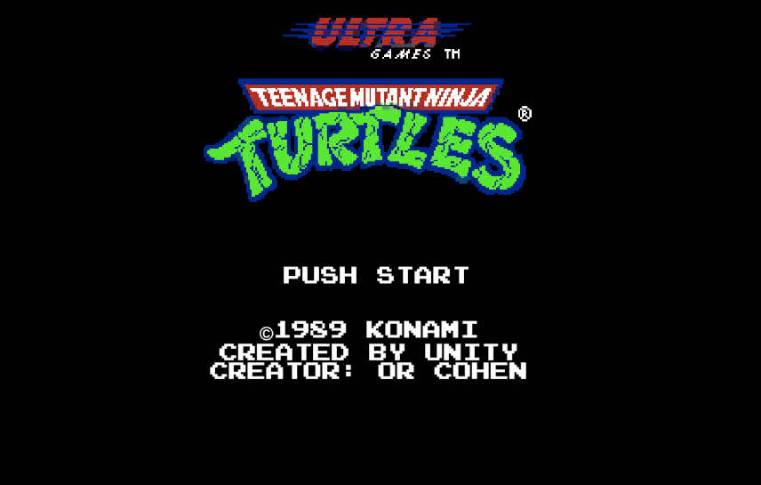
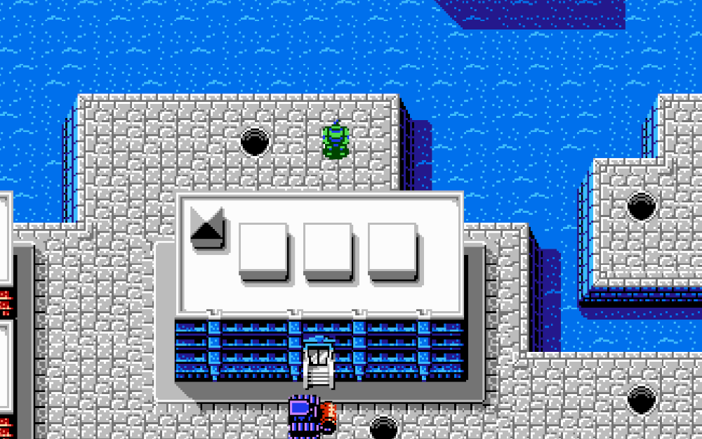
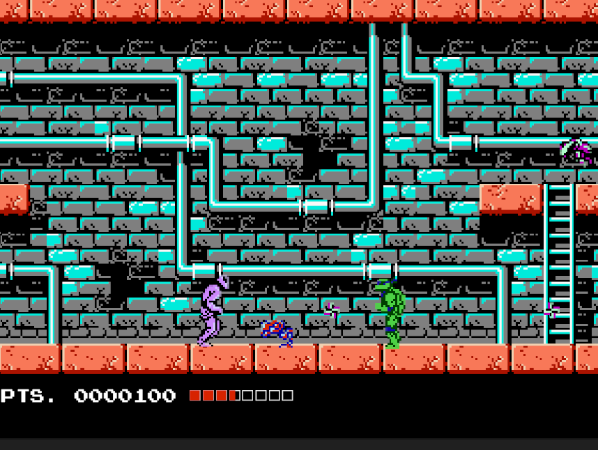

# ASCII Art Generator

ASCII Art Generator is a command-line program written in Java that converts images into ASCII art. It provides a simple interface for users to configure various parameters and generate ASCII art based on their preferences.

## Media

## Features

- Image to ASCII art conversion.
- Interactive command-line interface for configuration.
- Adjustable resolution and character set.
- Support for console and HTML output formats.

## Usage

- Use the `asciiArt` command to generate ASCII art.
- Use the `chars` command to view and modify the character set.
- Use the `res` command to adjust the resolution.
- Use the `image` command to specify the input image.
- Use the `output` command to choose the output format (console or HTML).

## Contributing

Contributions are welcome! Feel free to submit bug reports, feature requests, or pull requests to help improve the ASCII Art Generator.

## License

This project is licensed under the MIT License - see the [LICENSE](https://choosealicense.com/licenses/mit/) file for details.

